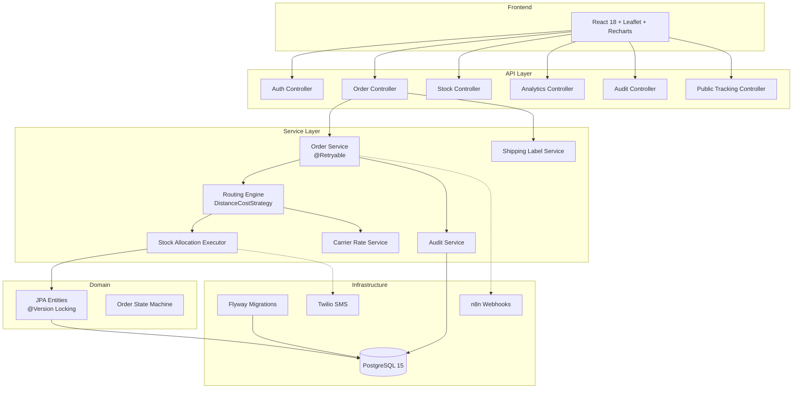

# STRIDE

**Supply chain Tracking, Routing, Inventory and Distribution Engine**


---

STRIDE is an enterprise-grade, intelligent supply chain management platform that optimizes multi-warehouse order routing using a weighted scoring algorithm with live carrier rate-shopping, predictive restocking, and real-time geospatial visualization.

---

## Key Features

| Feature | Description |
|---------|-------------|
| **Intelligent Routing Engine** | Multi-factor scoring algorithm (distance × cost × shortfall) with configurable weights |
| **Digital Twin Map** | Real-time interactive Leaflet map with animated route visualization |
| **Warehouse Floor Station** | Tablet-friendly terminal with virtual barcode scanner and real-time pick/pack queue |
| **PDF Shipping Label Engine** | Generates 4×6 thermal labels with Code-128 vector barcodes and carrier badges |
| **Public Tracking Portal** | Consumer-facing package tracking with live milestone timeline and journey map |
| **ESG Green Routing & Carbon Engine** | Calculates Scope 3 emissions (kg CO₂e) with eco-mode optimization and certified offset badges |
| **Inter-Hub Stock Transfers** | Automated cross-dock inventory rebalancing between fulfillment nodes |
| **B2B Developer Portal** | Programmatic API key management (X-API-Key: stride_live_...) for external ERP/Shopify sync |
| **Stress Test Simulator** | Fire hundreds of concurrent orders to validate optimistic locking correctness |
| **Analytics Dashboard** | Recharts-powered KPI visualizations: order volume trends, stock heatmaps, routing success rates |
| **Twilio SMS Alerts** | Predictive low-stock alerts based on daily sales velocity (not static thresholds) |
| **Carrier Rate-Shopping** | Mock FedEx/UPS/USPS integration for cost-optimized shipping selection |
| **JWT Authentication** | Stateless auth with role-based access control (ADMIN, WH_MANAGER) |
| **Audit Trail** | SOC2-compliant logging of every mutation with actor, timestamp, and JSONB details |
| **CSV Bulk Import/Export** | Upload/download stock data as CSV for warehouse operations |
| **Optimistic Locking** | `@Version`-based concurrency control preventing overselling under load |
| **Webhook Integration** | Post-commit event publishing to n8n/external systems with HMAC signing |
| **Production Monitoring** | Spring Boot Actuator with health, metrics, and Prometheus endpoints |

---

## Architecture



---

## Tech Stack

| Layer | Technology | Purpose |
|-------|-----------|---------|
| **Backend** | Java 17 + Spring Boot 3.2 | REST API, business logic |
| **Database** | PostgreSQL 15 | Persistent storage |
| **Migrations** | Flyway | Schema versioning |
| **Auth** | JJWT 0.12 | Stateless JWT tokens |
| **Frontend** | React 18 | Single-page application |
| **Maps** | Leaflet / react-leaflet | Geospatial visualization |
| **Charts** | Recharts | Analytics visualizations |
| **PDF & Barcode** | OpenPDF 1.3 | 4×6 shipping labels & Code-128 vector barcodes |
| **SMS** | Twilio SDK | Low-stock alerts |
| **API Docs** | SpringDoc OpenAPI | Swagger UI |
| **Monitoring** | Spring Boot Actuator | Health & metrics |
| **CI/CD** | GitHub Actions | Automated testing |
| **Containers** | Docker + Compose | One-command deployment |

---

## Quick Start

### Prerequisites
- Java 17+
- Docker & Docker Compose
- Node.js 18+ (for frontend development)

### Option 1: Docker (Recommended)
```bash
git clone https://github.com/abhinandbs12/stride.git
cd stride
docker-compose up -d
```
The app will be available at `http://localhost:8080`.

### Option 2: Manual Setup
```bash
# 1. Start PostgreSQL
docker-compose up -d postgres

# 2. Build & run backend
./mvnw spring-boot:run

# 3. Start frontend (in a new terminal)
cd frontend
npm install
npm start
```

### Default Login
```
Email:    admin@stride.io
Password: admin123
```

---

## API Reference

| Method | Endpoint | Description |
|--------|----------|-------------|
| `POST` | `/api/v1/auth/login` | Authenticate and receive JWT |
| `POST` | `/api/v1/auth/refresh` | Refresh access token |
| `GET` | `/api/v1/orders` | List orders (paginated, filterable) |
| `POST` | `/api/v1/orders` | Place & route a new order |
| `POST` | `/api/v1/orders/stress-test?count=50` | Launch concurrent stress test |
| `POST` | `/api/v1/orders/{id}/confirm` | Confirm an order |
| `POST` | `/api/v1/orders/{id}/cancel` | Cancel an order (releases stock) |
| `POST` | `/api/v1/orders/{id}/allocations/{aid}/pick` | Mark allocation as picked |
| `POST` | `/api/v1/orders/{id}/allocations/{aid}/ship` | Ship allocation (deducts stock) |
| `GET` | `/api/v1/orders/{id}/label` | Download 4×6 thermal shipping label PDF |
| `GET` | `/api/v1/orders/{id}/allocations/{aid}/label` | Download allocation shipping label PDF |
| `GET` | `/api/v1/public/track/{trackingRef}` | Public tracking milestone & route data (No Auth) |
| `GET` | `/api/v1/stock/transfers` | List active inter-hub stock transfers |
| `POST` | `/api/v1/stock/transfers` | Initiate inter-hub stock transfer |
| `POST` | `/api/v1/stock/transfers/{id}/complete` | Ingest transferred stock at destination hub |
| `GET` | `/api/v1/developer/keys` | List active B2B integration API keys |
| `POST` | `/api/v1/developer/keys` | Generate new integration API key |
| `DELETE` | `/api/v1/developer/keys/{id}` | Revoke integration API key |
| `GET` | `/api/v1/stock` | List stock items |
| `POST` | `/api/v1/stock` | Create or update stock |
| `POST` | `/api/v1/stock/import` | Bulk CSV import |
| `GET` | `/api/v1/stock/export` | CSV export |
| `GET` | `/api/v1/warehouses` | List warehouses |
| `GET` | `/api/v1/products` | List products |
| `GET` | `/api/v1/customers` | List customers |
| `GET` | `/api/v1/analytics/order-volume` | Order volume trends |
| `GET` | `/api/v1/analytics/stock-levels` | Stock levels per warehouse |
| `GET` | `/api/v1/analytics/routing-stats` | Routing success breakdown |
| `GET` | `/api/v1/analytics/esg-sustainability` | Scope 3 carbon emission & savings metrics |
| `GET` | `/api/v1/audit` | Query audit trail (ADMIN) |
| `GET` | `/actuator/health` | Application health check |

Full interactive docs available at: `http://localhost:8080/swagger-ui.html`

---

## Project Structure

```
STRIDE/
├── .github/workflows/       # CI/CD pipeline
├── frontend/                # React SPA
│   └── src/components/
│       ├── Dashboard.jsx    # Digital Twin Map + Stress Tester
│       ├── Analytics.jsx    # Recharts KPI Dashboard
│       ├── WarehouseStation.jsx # Floor Pick & Pack Terminal
│       ├── TrackingPortal.jsx   # Public Tracking Page
│       ├── DeveloperPortal.jsx  # B2B API Key & Webhook Manager
│       └── Login.jsx        # JWT Authentication UI
├── src/main/java/com/smartroute/
│   ├── config/              # Security, Routing, Twilio configs
│   ├── domain/
│   │   ├── entity/          # JPA entities (Order, StockItem, etc.)
│   │   ├── enums/           # OrderStatus, Role, etc.
│   │   └── state/           # Order state machine
│   ├── job/                 # Scheduled jobs (PredictiveRestockJob)
│   ├── notification/        # Twilio SMS + Webhook + Event system
│   ├── repository/          # Spring Data JPA repositories
│   ├── routing/             # Core routing algorithm
│   │   └── DistanceCostStrategy.java
│   ├── security/            # JWT filter, service, guards
│   ├── service/             # Business logic layer
│   └── web/
│       ├── controller/      # REST controllers
│       ├── dto/             # Request/Response DTOs
│       └── exception/       # Global error handling
├── src/main/resources/
│   ├── db/migration/        # Flyway SQL migrations (V1-V4)
│   └── application.yml      # Externalized configuration
├── Dockerfile               # Multi-stage production build
├── docker-compose.yml       # Full stack orchestration
└── pom.xml                  # Maven dependencies
```

---

## Testing

```bash
# Unit tests
./mvnw test

# Integration tests (requires Docker for Testcontainers)
./mvnw verify

# Concurrency stress test (via API)
curl -X POST http://localhost:8080/api/v1/orders/stress-test?count=100 \
  -H "Authorization: Bearer <token>" \
  -H "Content-Type: application/json" \
  -d '{"customerId":"...","lines":[{"productId":"...","quantity":1}]}'
```

---

## License

This project is licensed under the MIT License.
